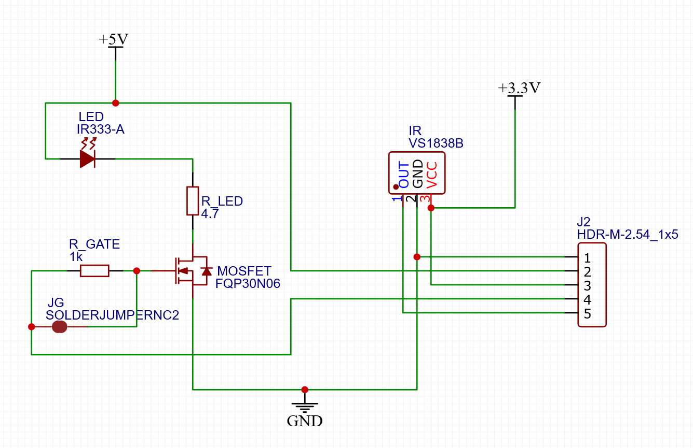

# IR Transceiver
My first custom PCB project.  A simple board for wiring an IR LED and receiver to a 3.3v controller board ([ESP8266 D1 Mini](https://www.wemos.cc/en/latest/d1/d1_mini.html) in my case), assuming a 5v/1A USB power supply. I then flash the D1 with [ESPHome](https://esphome.io/) so I can control various dumb home entertainment devices that normally require a dedicated remote control, all from my phone via [Home Assistant](https://www.home-assistant.io/). 

If you're in the US you can get 3 copies of the board manufactured and shipped from OSHPark for less than $5 with their [2 Layer Prototype Service](https://docs.oshpark.com/services/two-layer/). 

## Bill of Materials
- 1x RFP30N06LE MOSFET [link](https://www.amazon.com/dp/B07CTJFG7M)
- 1x VS1838B IR receiver [link](https://www.amazon.com/dp/B06XYNDRGF)
- 1x 5mm IR LED (need "bright" ones that can handle 1A pulses) [link](https://www.adafruit.com/product/388)
- 1x 4.7 Ohm resistor
- (Recommended) 1x 1k Ohm resistor 
- (Optional) 5 header pins

## Silkscreen Legend
Header pins:
- `G`: Ground (from D1 Mini pin)
- `5`: 5v input (from power supply; can tap the 5v pin on the D1 Mini ONLY IF that board is powered by the USB connector)
- `33`: 3.3v input (from D1 Mini pin)
- `L`: LED signal (any output pin on the D1 Mini)
- `R`: IR Receiver (any input pin on the D1 Mini)

Components:
- `R_LED`: current-limiting resistor for the LED (4.7 Ohm @ 5v ~= 1A)
- `R_GATE`: gate resistor for the MOSFET, reduces stand-by power consumption (1k Ohm)
- `JG`: Jumper for Gate. If you don't want to include a gate resistor, bridge this jumper with solder to bypass it. 
